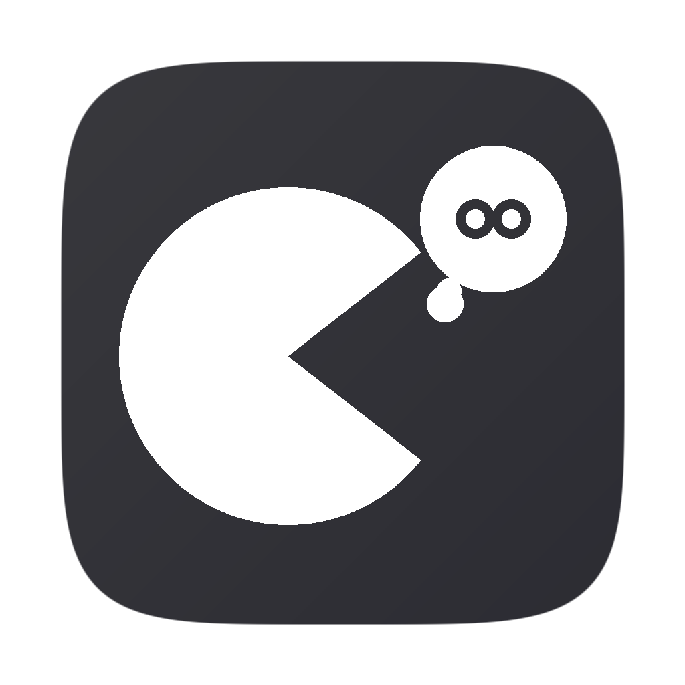

<p align="center">
  
</p>

<h1 align="center">FlipLingo</h1>

<p align="center">
  <a href="README.md">English</a> ·
  <b>日本語</b> ·
  <a href="README.ko.md">한국어</a>
</p>

<p align="center">
  <b>Mac のメニューバーから瞬時に多言語翻訳</b><br>
  テキストを選択 → ショートカットを押す → その場で翻訳
</p>

<p align="center">
  
  
  
  
</p>

---

## 特徴

- **即時置換** — テキストを選択して `⌘⇧T` を押すと、翻訳結果に置き換わります
- **プレビューモード** — `⌘⇧Y` で適用前に翻訳結果をプレビュー
- **12言語対応** — 日本語、韓国語、英語、中国語、ドイツ語、フランス語、スペイン語、ポルトガル語、イタリア語、オランダ語、ポーランド語、ロシア語
- **ソース言語の自動検出** — DeepL が原文の言語を自動判定
- **置換とプレビューで別々の翻訳先** — 置換モードとプレビューモードに異なる言語を設定可能
- **どこでも動作** — ネイティブアプリ（テキストエディット、メモ）は Accessibility API、Electron アプリ（Slack、Chrome）はクリップボードフォールバックで対応
- **ショートカットのカスタマイズ** — 設定からホットキーを変更可能
- **メニューバーアプリ** — アニメーションするパックマンアイコンがメニューバーに常駐
- **4つの UI 言語** — 日本語、韓国語、英語、中国語

## インストール

### DMG から（推奨）

1. [Releases](../../releases) から `FlipLingo.dmg` をダウンロード
2. `FlipLingo.app` をアプリケーションフォルダにドラッグ
3. 初回起動時: 右クリック → 開く（Gatekeeper を回避）

### ソースからビルド

```bash
git clone https://github.com/YOUR_USERNAME/FlipLingo.git
cd FlipLingo
swift build
```

ビルドしたバイナリをアプリバンドルにコピーします:

```bash
mkdir -p FlipLingo.app/Contents/MacOS
mkdir -p FlipLingo.app/Contents/Resources
cp .build/arm64-apple-macosx/debug/FlipLingo FlipLingo.app/Contents/MacOS/
cp Info.plist FlipLingo.app/Contents/
```

## セットアップ

1. **DeepL API キー** — [deepl.com/pro-api](https://www.deepl.com/pro-api) で無料キーを取得（月50万文字まで無料）
2. **アクセシビリティ権限** — システム設定 > プライバシーとセキュリティ > アクセシビリティ → FlipLingo を有効化
3. メニューバーアイコンをクリック → 設定 → API キーを入力

## 使い方

| ショートカット | 動作 |
|----------|--------|
| `⌘⇧T` | 選択したテキストを翻訳して置換 |
| `⌘⇧Y` | 翻訳をプレビュー（読み取り専用ポップアップ） |

### 設定

- **翻訳先言語** — 置換ショートカット用の言語
- **プレビュー翻訳先言語** — プレビューショートカット用の言語（別の言語を指定可能）
- **置換時にプレビュー** — `⌘⇧T` でも確認ポップアップを表示
- **アプリ言語** — UI を 日本語 / 한국어 / English / 中文 で切り替え

## アーキテクチャ

```
Sources/
├── main.swift               # エントリポイント、メニューバー、AppDelegate
├── HotkeyManager.swift      # Carbon グローバルホットキー（⌘⇧T, ⌘⇧Y）
├── ClipboardManager.swift   # AXUIElement + osascript フォールバック
├── TranslationService.swift # DeepL API、12言語
├── TranslationPopup.swift   # プレビューポップアップ UI
├── SettingsView.swift       # 設定（カードベース UI）
├── ShortcutRecorderView.swift # ショートカットレコーダー
└── Localization.swift       # 4つの UI 言語（ja/ko/en/zh）
```

## 動作環境

- macOS 13.0 以降
- Swift 5.9 以降
- DeepL API Free キー

## ライセンス

MIT
